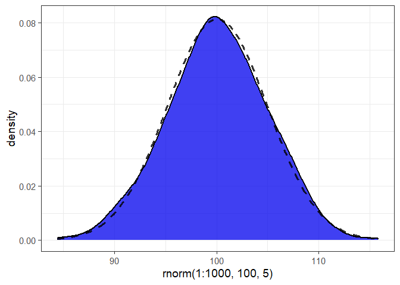
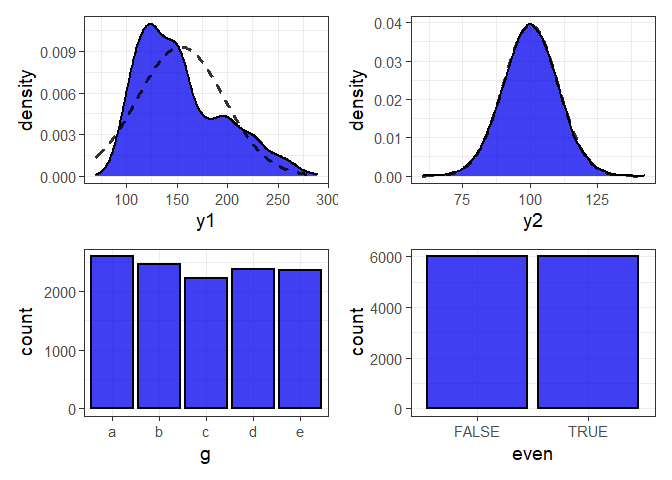

<!-- README.md is generated from README.Rmd. Please edit that file -->

# elucidate 

## Project Status

<!-- badges: start -->

[](https://github.com/bcgov/repomountie/blob/master/doc/lifecycle-badges.md)
[](https://github.com/bcgov/elucidate/actions)
<!-- badges: end -->

This package is currently maintained by [Craig
Hutton](https://craig.rbind.io/), a Data Scientist working with the
Research Branch of the [British Columbia Ministry of Social Development
& Poverty
Reduction](https://www2.gov.bc.ca/gov/content/governments/organizational-structure/ministries-organizations/ministries/social-development-poverty-reduction).

## Why `elucidate`?

`elucidate` provides a collection of convenience functions to make
exploratory data analysis in R easier and more accessible for
researchers to (among other things):

-   Interrogate data in search of row duplicates with `dupes()` and
    anomalous values with the `counts*` set of functions.

-   Describe data with the `describe*` set of functions for obtaining
    summary statistics, bootstrapping confidence intervals, and
    detecting missing values.

-   Quickly visualise and interact with data representations with the
    `plot_*` set of functions.

Inspired by tidyverse naming conventions, the core functions of
`elucidate` are organized into sets that begin with a common root
(e.g. `describe*`, `plot_*`), since this enables the user to see them
all as suggestions as you are coding in R studio.

Drawing from similar inspiration, many `elucidate` functions are also
designed to accept a data object as the 1st argument and return a data
or plotting object (e.g. ggplot2 or plotly) so they are compatible with
the pipe operator from the
[magrittr](https://magrittr.tidyverse.org/reference/pipe.html) package
for easy integration into data processing pipelines.

For a comprehensive introduction to the package see the vignette via
`vignette("elucidate")`.

## Installation

You can install the development version of elucidate from this
repository with:

``` r
# use the remotes package to install from a github repository

install.packages("remotes") #only run this 1st if you haven't installed remotes before

remotes::install_github("bcgov/elucidate")
```

The authors of `elucidate` acknowledge and express their gratitude to
the authors of the [tidyverse packages](https://www.tidyverse.org/),
[data.table](https://github.com/Rdatatable/data.table), and the
functions of other dependency packages which were used to build
`elucidate`, since without their effort and ingenuity `elucidate` would
mostly have remained a collection of ideas instead of functions.

## Usage

`dupes()` can tell you how many rows are duplicated based on one or more
variables (default is all of them).

``` r
library(elucidate)
#> Loading required package: ggplot2
#> 
#> Attaching package: 'elucidate'
#> The following object is masked from 'package:base':
#> 
#>     mode

#list any number of variables to use when searching for duplicates after the
#data argument
dupes(pdata, d) 
#> Duplicated rows detected! 12000 of 12000 rows in the input data have multiple copies.
#> # A tibble: 12,000 x 11
#>       id d          g     high_low even     y1    y2    x1    x2    x3 n_copies
#>    <int> <date>     <fct> <chr>    <lgl> <dbl> <dbl> <int> <int> <int>    <int>
#>  1     1 2019-01-01 e     high     FALSE  144. 112.     86   199   261     1000
#>  2     2 2019-01-01 c     low      TRUE   262.  91.8    88   104   224     1000
#>  3     3 2019-01-01 d     high     FALSE  224. 120.     29   192   224     1000
#>  4     4 2019-01-01 c     high     TRUE   262. 102.     77   151   254     1000
#>  5     5 2019-01-01 a     low      FALSE  167.  91.6    75   186   258     1000
#>  6     6 2019-01-01 a     low      TRUE   163.  83.6    39   152   293     1000
#>  7     7 2019-01-01 d     low      FALSE  247.  98.9    88   177   202     1000
#>  8     8 2019-01-01 b     high     TRUE   189. 102.     79   163   217     1000
#>  9     9 2019-01-01 e     high     FALSE  156. 110.      4   136   220     1000
#> 10    10 2019-01-01 c     low      TRUE   248.  95.9    63   113   213     1000
#> # ... with 11,990 more rows
#in this case we search for duplicated based on the "d" (date) column        
```

`describe()` a single variable in a data frame or a vector of values.

``` r
#set random generator seed for reproducibility
set.seed(1234)

#using a numeric vector as input
describe(data = rnorm(1:1000, 100, 5))
#> # A tibble: 1 x 14
#>   cases     n    na  p_na  mean    sd    se    p0   p25   p50   p75  p100   skew
#>   <int> <int> <int> <dbl> <dbl> <dbl> <dbl> <dbl> <dbl> <dbl> <dbl> <dbl>  <dbl>
#> 1  1000  1000     0     0  99.9  4.99 0.158  83.0  96.6  99.8  103.  116. -0.005
#> # ... with 1 more variable: kurt <dbl>
```

`describe_all()` all variables in a data frame.

``` r
describe_all(pdata)
#> $date
#> # A tibble: 1 x 8
#>   variable cases     n    na  p_na n_unique start      end       
#>   <chr>    <int> <int> <int> <dbl>    <int> <date>     <date>    
#> 1 d        12000 12000     0     0       12 2008-01-01 2019-01-01
#> 
#> $factor
#> # A tibble: 1 x 8
#>   variable cases     n    na  p_na n_unique ordered counts_tb                   
#>   <chr>    <int> <int> <int> <dbl>    <int> <lgl>   <chr>                       
#> 1 g        12000 12000     0     0        5 FALSE   a_2592, b_2460, ..., e_2352~
#> 
#> $character
#> # A tibble: 1 x 9
#>   variable cases     n    na  p_na n_unique min_chars max_chars counts_tb       
#>   <chr>    <int> <int> <int> <dbl>    <int>     <int>     <int> <chr>           
#> 1 high_low 12000 12000     0     0        2         3         4 high_6045, low_~
#> 
#> $logical
#> # A tibble: 1 x 8
#>   variable cases     n    na  p_na n_TRUE n_FALSE p_TRUE
#>   <chr>    <int> <int> <int> <dbl>  <dbl>   <dbl>  <dbl>
#> 1 even     12000 12000     0     0   6000    6000    0.5
#> 
#> $numeric
#> # A tibble: 6 x 15
#>   variable cases     n    na  p_na  mean    sd    se    p0   p25   p50   p75
#>   <chr>    <int> <int> <int> <dbl> <dbl> <dbl> <dbl> <dbl> <dbl> <dbl> <dbl>
#> 1 id       12000 12000     0     0 500.  289.  2.64    1   251.   500.  750.
#> 2 y1       12000 12000     0     0 154.   42.7 0.39   69.2 121.   145.  181.
#> 3 y2       12000 12000     0     0 100.   10.1 0.092  60.0  93.4  100.  107.
#> 4 x1       12000 12000     0     0  50.5  28.9 0.264   1    25     50    75 
#> 5 x2       12000 12000     0     0 151.   28.8 0.263 101   126    150   176 
#> 6 x3       12000 12000     0     0 250.   28.9 0.264 201   225    251   276 
#> # ... with 3 more variables: p100 <dbl>, skew <dbl>, kurt <dbl>
```

Use `plot_var()` to produce a class-appropriate
[ggplot2](https://ggplot2.tidyverse.org/) graph of a single variable in
a data frame or a vector of values.

``` r
plot_var(data = rnorm(1:1000, 100, 5)) 
```



``` r
#in this case we get a density plot with a normal density curve added for
#reference (dashed line).
```

To generate class-appropriate `ggplot2` graphs for all variables in a
data frame and combine them into a multiple-panel figure with the
[patchwork](https://patchwork.data-imaginist.com/index.html) package,
use `plot_var_all()`. You can also limit the graphing to a subset of
columns with the “cols” argument, which accepts a character vector of
column names.

``` r
plot_var_all(pdata, cols = c("y1", "y2", "g", "even"))
```



``` r
#density plots for numeric variables and bar graphs for categorical variables
```

## Learn more

These examples only highlight a few of the many things `elucidate` can
do. You can learn more from these additional resources:

-   A **[blog
    post](https://craig.rbind.io/post/2020-12-07-asgr-3-0-exploring-data-with-elucidate/)**,
    which was written to help researchers and science trainees learn how
    to use the package for common exploratory data analysis tasks.

-   The **introductory vignette** (`vignette("elucidate")`), which
    provides annotated code examples that demonstrate most of the
    package’s functionality.

## Reporting an Issue

To report bugs/issues or request feature changes, open an
[issue](https://github.com/bcgov/elucidate/issues) for the package
GitHub repo. If raising an issue, *please provide a reproducible
example* ([reprex](https://www.tidyverse.org/help/)) of the problem
you’re encountering.

## Requesting Features and/or Changes

To suggest changes or code improvements, please submit a [pull
request](https://github.com/bcgov/elucidate/pulls).

## License

Copyright 2021 Province of British Columbia

Licensed under the Apache License, Version 2.0 (the “License”); you may
not use this file except in compliance with the License. You may obtain
a copy of the License at:

<http://www.apache.org/licenses/LICENSE-2.0>

Unless required by applicable law or agreed to in writing, software
distributed under the License is distributed on an “AS IS” BASIS,
WITHOUT WARRANTIES OR CONDITIONS OF ANY KIND, either express or implied.
See the License for the specific language governing permissions and
limitations under the License.
