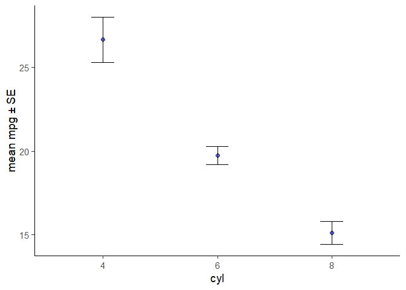

<!-- README.md is generated from README.Rmd. Please edit that file -->

# elucidate 

## Project Status

[](https://github.com/bcgov/repomountie/blob/master/doc/lifecycle-badges.md)

This package is currently maintained by [Craig
Hutton](https://craig.rbind.io/), a Data Scientist working with the
Research Branch of the [British Columbia Ministry of Social Development
& Poverty
Reduction](https://www2.gov.bc.ca/gov/content/governments/organizational-structure/ministries-organizations/ministries/social-development-poverty-reduction).

## Why `elucidate`?

`elucidate` provides a collection of convenience functions to make
exploratory data analysis in R easier and more accessible for
researchers to:

  - Interrogate data in search of row duplications and anomalous values
    with `copies()` and the `counts*` set of functions.

  - Describe data with the `describe*` set of functions for obtaining
    summary statistics, bootstrapping confidence intervals, and
    detecting missing values.

  - Quickly visualise and interact with data representations with
    `static_to_dynamic()` and the `plot_*` set of functions.

Inspired by tidyverse naming conventions, the core functions of
`elucidate` are organized into sets that begin with a common root
(e.g. `describe*`, `plot_*`), since this enables the user to see them
all as suggestions as you are coding in R studio.

Drawing from similar inspiration, many elucidate functions are also
designed to accept a data object as the 1st argument and return a data
or plotting object (e.g. ggplot2 or plotly) so they are compatible with
the pipe operator from the
[magrittr](https://magrittr.tidyverse.org/reference/pipe.html) package
for easy integration into data processing pipelines. For convenience,
the pipe operator (`%>%`) is also imported from `magrittr` when
`elucidate` is loaded.

## Installation

You can install the development version of elucidate from this
repository with:

``` r
# use the remotes package to install from a github repository

install.packages("remotes") #only run this 1st if you haven't installed remotes before

remotes::install_github("bcgov/elucidate")
```

The authors of `elucidate` acknowledge and express their gratitude to
the authors of the [tidyverse packages](https://www.tidyverse.org/),
[data.table](https://github.com/Rdatatable/data.table), and the
functions of other dependency packages which were used to build
`elucidate`, since without their effort and ingenuity `elucidate` would
mostly have remained a collection of ideas instead of functions.

## Usage

`copies()` can tell you how many rows are duplicated based on one or
more variables (default is all of them). To return duplicated rows only
we can set the filter argument to “dupes”.

``` r
library(elucidate)
#> 
#> Attaching package: 'elucidate'
#> The following object is masked from 'package:base':
#> 
#>     mode

copies(pdata,
       #list any number of variables to use when searching for duplicates after
       #the data argument
       d, #in this case we search for duplicated based on the "d" (date) column
       filter = "dupes") #return duplicated rows only
#> Duplicated rows detected! 12000 of 12000 rows in the input data have multiple copies.
#> # A tibble: 12,000 x 11
#>       id d          g     high_low even     y1    y2    x1    x2    x3 n_copies
#>    <int> <date>     <fct> <chr>    <lgl> <dbl> <dbl> <int> <int> <int>    <int>
#>  1     1 2008-01-01 e     high     FALSE 106.  118.     59   116   248     1000
#>  2     2 2008-01-01 c     high     TRUE   96.5 107.      5   101   238     1000
#>  3     3 2008-01-01 d     low      FALSE  99.3  96.2    71   111   250     1000
#>  4     4 2008-01-01 c     high     TRUE  109.  102.     60   130   287     1000
#>  5     5 2008-01-01 a     high     FALSE  99.7 113.     96   196   284     1000
#>  6     6 2008-01-01 a     high     TRUE  102.  114.     19   163   206     1000
#>  7     7 2008-01-01 d     low      FALSE  91.0  87.9    77   133   201     1000
#>  8     8 2008-01-01 b     low      TRUE  109.   98.7    74   191   249     1000
#>  9     9 2008-01-01 e     low      FALSE  99.8  89.8    92   106   277     1000
#> 10    10 2008-01-01 c     low      TRUE  122.   83.6     4   134   209     1000
#> # ... with 11,990 more rows
```

Use `describe()` to describe a single variable in a data frame of vector
of values:

``` r
#using a numeric vector as input
describe(data = rnorm(1:1000, 100, 5))
#> # A tibble: 1 x 14
#>   cases     n    na  p_na  mean    sd    se    p0   p25   p50   p75  p100  skew
#>   <int> <int> <int> <dbl> <dbl> <dbl> <dbl> <dbl> <dbl> <dbl> <dbl> <dbl> <dbl>
#> 1  1000  1000     0     0  100.  4.99 0.158  84.4  97.0  100.  104.  117.  0.11
#> # ... with 1 more variable: kurt <dbl>
```

To describe all variables in a data frame, use `describe_all()`:

``` r
#if more than one class of variable is summarized you'll get a list
#if only one class is present in the data, or only one is requested, you'll get a dataframe

describe_all(pdata,
             #you can ask for a "tibble" or "dt" (data.table) as output options
             #default is currently "tibble", as in the previous example.
             output = "dt") 
#> $date
#>    variable cases     n na p_na n_unique      start        end
#> 1:        d 12000 12000  0    0       12 2008-01-01 2019-01-01
#> 
#> $factor
#>    variable cases     n na p_na n_unique ordered
#> 1:        g 12000 12000  0    0        5   FALSE
#>                              counts_tb
#> 1: a_2592, b_2460, ..., e_2352, c_2220
#> 
#> $character
#>    variable cases     n na p_na n_unique min_chars max_chars
#> 1: high_low 12000 12000  0    0        2         3         4
#>              counts_tb
#> 1: high_6045, low_5955
#> 
#> $logical
#>    variable cases     n na p_na n_TRUE n_FALSE p_TRUE
#> 1:     even 12000 12000  0    0   6000    6000    0.5
#> 
#> $numeric
#>    variable cases     n na p_na    mean      sd    se      p0     p25     p50
#> 1:       id 12000 12000  0    0 500.500 288.687 2.635   1.000 250.750 500.500
#> 2:       y1 12000 12000  0    0 153.705  42.724 0.390  69.224 120.941 144.782
#> 3:       y2 12000 12000  0    0 100.092  10.120 0.092  59.963  93.351 100.128
#> 4:       x1 12000 12000  0    0  50.495  28.937 0.264   1.000  25.000  50.000
#> 5:       x2 12000 12000  0    0 150.651  28.820 0.263 101.000 126.000 150.000
#> 6:       x3 12000 12000  0    0 250.497  28.865 0.264 201.000 225.000 251.000
#>        p75     p100   skew   kurt
#> 1: 750.250 1000.000  0.000 -1.200
#> 2: 181.022  289.235  0.739 -0.181
#> 3: 106.906  142.181 -0.032  0.059
#> 4:  75.000  100.000  0.008 -1.208
#> 5: 176.000  200.000  0.002 -1.209
#> 6: 276.000  300.000  0.006 -1.214
```

Only want to summarise certain variable classes? No problem, use the
“class” argument.

Would you like a description for each level of a grouping variable? Just
provide the unquoted name of the column to use for splitting.

``` r

pdata %>% 
  describe_all(g, #get a description for each level of the "g" column
               class = "n") #describe numeric columns only
#> # A tibble: 30 x 16
#>    g     variable cases     n    na  p_na  mean    sd    se    p0   p25   p50
#>    <fct> <chr>    <int> <int> <int> <dbl> <dbl> <dbl> <dbl> <dbl> <dbl> <dbl>
#>  1 e     id        2352  2352     0     0 526.  290.  5.98    1   266.   536.
#>  2 e     y1        2352  2352     0     0 135.   18.6 0.383  75.1 123.   137.
#>  3 e     y2        2352  2352     0     0 100.   10.3 0.212  62.3  93.1  100.
#>  4 e     x1        2352  2352     0     0  50.7  28.7 0.593   1    26     51 
#>  5 e     x2        2352  2352     0     0 151.   28.6 0.59  101   126    151 
#>  6 e     x3        2352  2352     0     0 250.   28.6 0.589 201   225    250 
#>  7 c     id        2220  2220     0     0 495.  266.  5.64    2   286    484 
#>  8 c     y1        2220  2220     0     0 177.   57.0 1.21   77.0 127.   165.
#>  9 c     y2        2220  2220     0     0  99.9  10.1 0.214  60.0  93.4  100.
#> 10 c     x1        2220  2220     0     0  49.9  29.0 0.615   1    24     49 
#> # ... with 20 more rows, and 4 more variables: p75 <dbl>, p100 <dbl>,
#> #   skew <dbl>, kurt <dbl>
```

Use the `plot_*` set of functions to easily generate customized ggplot2
visualisations:

``` r
data(mtcars)

#customized density plot
mtcars %>% plot_density(x = mpg,
                        colour_var = cyl, #assign a variable to colour
                        colour_var_order = c("6", "8", "4"), #reorder the levels of the colour variable
                        colour_var_labs = c("six" = "6", "eight" = "8"), #recode the colour variable labels
                        colour_var_values = c("blue3", "red3", "green3"), #change the colours from the ggplot2 defaults
                        colour_var_title = "# cylinders")
```


``` r

#plot group means with SE error bars
mtcars %>% 
  plot_stat_error(y = mpg, x = cyl,
                  stat = "mean", error = "se",
                  alpha = 0.6, fill = "blue2")
```



These examples only highlight a few of the many things `elucidate` can
do. **Check out [this blog
post](https://craig.rbind.io/post/2020-12-07-asgr-3-0-exploring-data-with-elucidate/)
for a comprehensive guide.**

## Development Notes

`elucidate` is still in the formative stage of development and
considerable changes may occur to it in the near future.

## Reporting an Issue

To report bugs/issues or request feature changes, open an
[issue](https://github.com/bcgov/elucidate/issues) for the package
GitHub repo. If raising an issue, *please provide a reproducible
example* ([reprex](https://www.tidyverse.org/help/)) of the problem
you’re encountering.

## Requesting Features/Changes

To suggest changes or code improvements, please submit a [pull
request](https://github.com/bcgov/elucidate/pulls).

## License

Copyright 2021 Province of British Columbia

Licensed under the Apache License, Version 2.0 (the “License”); you may
not use this file except in compliance with the License. You may obtain
a copy of the License at

<http://www.apache.org/licenses/LICENSE-2.0>

Unless required by applicable law or agreed to in writing, software
distributed under the License is distributed on an “AS IS” BASIS,
WITHOUT WARRANTIES OR CONDITIONS OF ANY KIND, either express or implied.
See the License for the specific language governing permissions and
limitations under the License.
