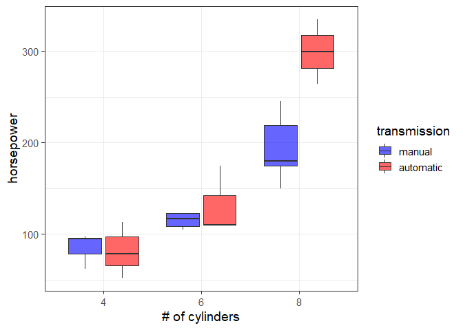
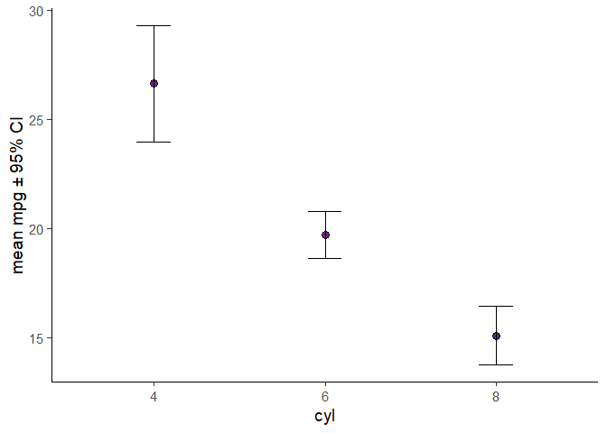

<!-- README.md is generated from README.Rmd. Please edit that file -->

# elucidate

<!-- badges: start -->

<a id="devex-badge" rel="Exploration" href="https://github.com/BCDevExchange/assets/blob/master/README.md"></a>
<!-- badges: end -->

## Project Status

This package is currently maintained by [Craig
Hutton](https://craig.rbind.io/), a Data Science Fellow working with the
Data Science and Analytics Branch of the [British Columbia Ministry of
Citizens’
Services](https://www2.gov.bc.ca/gov/content/governments/organizational-structure/ministries-organizations/ministries/citizens-services)
and the Research Branch of the [British Columbia Ministry of Social
Development & Poverty
Reduction](https://www2.gov.bc.ca/gov/content/governments/organizational-structure/ministries-organizations/ministries/social-development-poverty-reduction).

## Why `elucidate`?

`Elucidate` provides a collection of convenience functions to make data
analysis in R easier and more accessible for researchers:

  - Functions that help summarize data of multiple types (numeric,
    character strings, logicals, etc.) using descriptive statistics
    (`describe*`) split by any number of grouping variables with
    comparable performance to existing alternatives and enhanced
    customization via arguments.

  - Functions that make it easier to access the power of the
    [boot](https://cran.r-project.org/web/packages/boot/index.html)
    package to obtain confidence intervals for a variety of summary
    statistics (`*_ci`), with options for within-group calculations and
    parallelized computation to maximize performance.

  - Functions that help you visualize your data using the popular
    [ggplot2](https://ggplot2.tidyverse.org/) &
    [plotly](https://plot.ly/r/) packages more easily via a relatively
    simple API with sensible and well documented arguments rather than
    layers (`plot_*`).

  - Miscellaneous functions that fill in a few of the (rare) gaps in
    `R`’s statistical computing & data science toolkit, e.g. functions
    which are easy for experienced users to write on the fly but are
    challenging for `R` novices or researchers without programming
    experience to implement: the standard error of the mean (`se`), an
    operator that returns the values that do not match a vector (`%ni%`,
    i.e. the opposite of `%in%`), the mode of a numeric variable
    (`mode_of_y`), etc.

Inspired by tidyverse naming conventions, the core functions of
`elucidate` are organized into sets that begin with a common root
(e.g. `describe*`, `plot_*`), since this enables the user to see them
all as suggestions as you are coding in R studio.

Drawing from similar inspiration, many elucidate functions are also
designed to accept a data object as the 1st argument and to return a
data or plotting object (e.g. ggplot2 or plotly) so they are compatible
with the pipe operator from the
[magrittr](https://magrittr.tidyverse.org/reference/pipe.html) package
for easy integration into data processing pipelines.

## Installation

You can install the development version of elucidate from the [BC SDPR
Research Branch Azure
repository](https://dev.azure.com/BC-SDPR-Research/R-elucidate)
with:

``` r
install.packages("R:/ResearchDB/repos/cache/local.r/elucidate_0.0.0.9009.tar.gz",
                 repos = NULL, type="source", dependencies = TRUE)
```

Note: this currently requires a connect to the local SDPR network while
access to `elucidate` is limited to the [British Columbia Ministry of
Social Development & Poverty
Reduction](https://www2.gov.bc.ca/gov/content/governments/organizational-structure/ministries-organizations/ministries/social-development-poverty-reduction)
Research branch. Installation instructions will be updated after public
release (pending administration approval).

The authors of `elucidate` acknowledge and express their gratitude to
the authors of the [tidyverse packages](https://www.tidyverse.org/),
[data.table](https://github.com/Rdatatable/data.table), and the
functions of other dependency packages which were used to build
`elucidate`, since without their effort and ingenuity `elucidate` would
mostly have remained a collection of ideas instead of functions.

## Usage

Use `describe()` to describe a single variable in a data frame of vector
of values:

``` r
library(elucidate)

#using a vector as input
describe(data = rnorm(1:1000, 100, 5))
#> # A tibble: 1 x 14
#>   cases     n    na  p_na  mean    sd    se    p0   p25   p50   p75  p100
#>   <int> <int> <int> <dbl> <dbl> <dbl> <dbl> <dbl> <dbl> <dbl> <dbl> <dbl>
#> 1  1000  1000     0     0  99.7  5.00 0.158  81.7  96.4  99.7  103.  117.
#> # ... with 2 more variables: skew <dbl>, kurt <dbl>

#using a data frame and specifying a variable in that data frame

describe(data = pdata, y = y1) #no grouping variables, numeric input class 
#> # A tibble: 1 x 14
#>   cases     n    na  p_na  mean    sd    se    p0   p25   p50   p75  p100
#>   <int> <int> <int> <dbl> <dbl> <dbl> <dbl> <dbl> <dbl> <dbl> <dbl> <dbl>
#> 1 10000 10000     0     0  50.0  5.02  0.05  30.5  46.6  50.0  53.3  67.8
#> # ... with 2 more variables: skew <dbl>, kurt <dbl>

describe(pdata, g2) #factor input class 
#> # A tibble: 1 x 11
#>   cases     n    na  p_na n_unique ordered v1_n   v2_n   v3_n   v4_n  v5_n 
#>   <int> <int> <int> <dbl>    <int> <lgl>   <chr>  <chr>  <chr>  <chr> <chr>
#> 1 10000 10000     0     0        5 FALSE   a_2000 b_2000 c_2000 d_20~ e_20~

describe(pdata, even) #logical input class 
#> # A tibble: 1 x 8
#>   cases     n    na  p_na n_TRUE n_FALSE p_TRUE p_FALSE
#>   <int> <int> <int> <dbl>  <dbl>   <dbl>  <dbl>   <dbl>
#> 1 10000 10000     0     0   5000    5000    0.5     0.5

pdata %>% describe(high_low) #character input class, data piped in
#> # A tibble: 1 x 7
#>   cases     n    na  p_na n_unique v1_n      v2_n    
#>   <int> <int> <int> <dbl>    <int> <chr>     <chr>   
#> 1 10000 10000     0     0        2 high_5041 low_4959

describe(pdata, d) #date input class 
#> # A tibble: 1 x 7
#>   cases     n    na  p_na n_unique start      end       
#>   <int> <int> <int> <dbl>    <int> <date>     <date>    
#> 1 10000 10000     0     0    10000 2000-01-01 2027-05-18

#obtain within-group summaries by adding grouping variables

describe(pdata, y1, high_low) #one grouping variable
#> # A tibble: 2 x 15
#>   high_low cases     n    na  p_na  mean    sd    se    p0   p25   p50
#>   <chr>    <int> <int> <int> <dbl> <dbl> <dbl> <dbl> <dbl> <dbl> <dbl>
#> 1 low       4959  4959     0     0  50.0  4.97 0.071  30.5  46.6  50.0
#> 2 high      5041  5041     0     0  50.0  5.06 0.071  33.8  46.6  50.1
#> # ... with 4 more variables: p75 <dbl>, p100 <dbl>, skew <dbl>, kurt <dbl>

describe(pdata, y1, high_low, g2) #two grouping variables
#> # A tibble: 10 x 16
#>    high_low g2    cases     n    na  p_na  mean    sd    se    p0   p25
#>    <chr>    <fct> <int> <int> <int> <dbl> <dbl> <dbl> <dbl> <dbl> <dbl>
#>  1 low      a      1013  1013     0     0  50.0  5.12 0.161  36.9  46.7
#>  2 high     a       987   987     0     0  50.0  5.06 0.161  34.0  46.6
#>  3 high     b      1016  1016     0     0  50.2  5.02 0.158  36.7  46.8
#>  4 low      b       984   984     0     0  50.1  4.88 0.156  33.3  46.7
#>  5 low      c      1009  1009     0     0  49.8  4.88 0.154  33.7  46.6
#>  6 high     c       991   991     0     0  49.9  5.14 0.163  34.3  46.6
#>  7 low      d       990   990     0     0  50.1  4.93 0.157  30.5  47.0
#>  8 high     d      1010  1010     0     0  50.2  5.19 0.163  34.3  46.8
#>  9 low      e       963   963     0     0  49.8  5.06 0.163  34.6  46.2
#> 10 high     e      1037  1037     0     0  49.7  4.88 0.151  33.8  46.4
#> # ... with 5 more variables: p50 <dbl>, p75 <dbl>, p100 <dbl>, skew <dbl>,
#> #   kurt <dbl>

description <- describe(pdata, y1, high_low, g2, even) #three grouping variables
```

To describe all variables in a data frame, use `describe_all()`:

``` r

#if more than one class of variable is summarized you'll get a list
#if only one class is present in the data, or only one is requested, you'll get a dataframe

describe_all(pdata) #all summary types in a list, not split by any grouping variables
#> $date
#> # A tibble: 1 x 8
#>   variable cases     n    na  p_na n_unique start      end       
#>   <chr>    <int> <int> <int> <dbl>    <int> <date>     <date>    
#> 1 d        10000 10000     0     0    10000 2000-01-01 2027-05-18
#> 
#> $factor
#> # A tibble: 1 x 12
#>   variable cases     n    na  p_na n_unique ordered v1_n  v2_n  v3_n  v4_n 
#>   <chr>    <int> <int> <int> <dbl>    <int> <lgl>   <chr> <chr> <chr> <chr>
#> 1 g2       10000 10000     0     0        5 FALSE   a_20~ b_20~ c_20~ d_20~
#> # ... with 1 more variable: v5_n <chr>
#> 
#> $character
#> # A tibble: 1 x 8
#>   variable cases     n    na  p_na n_unique v1_n      v2_n    
#>   <chr>    <int> <int> <int> <dbl>    <int> <chr>     <chr>   
#> 1 high_low 10000 10000     0     0        2 high_5041 low_4959
#> 
#> $logical
#> # A tibble: 1 x 9
#>   variable cases     n    na  p_na n_TRUE n_FALSE p_TRUE p_FALSE
#>   <chr>    <int> <int> <int> <dbl>  <dbl>   <dbl>  <dbl>   <dbl>
#> 1 even     10000 10000     0     0   5000    5000    0.5     0.5
#> 
#> $numeric
#> # A tibble: 7 x 15
#>   variable cases     n    na  p_na   mean     sd     se    p0    p25    p50
#>   <chr>    <int> <int> <int> <dbl>  <dbl>  <dbl>  <dbl> <dbl>  <dbl>  <dbl>
#> 1 id       10000 10000     0     0 5000.  2.89e3 28.9     1   2501.  5000. 
#> 2 x1       10000 10000     0     0   51.0 2.89e1  0.289   1     26     51  
#> 3 x2       10000 10000     0     0  151.  2.89e1  0.289 101    125    151  
#> 4 x3       10000 10000     0     0  250.  2.91e1  0.291 201    225    250  
#> 5 y1       10000 10000     0     0   50.0 5.02e0  0.05   30.5   46.6   50.0
#> 6 y2       10000 10000     0     0   80.1 5.03e0  0.05   62.1   76.7   80.1
#> 7 y3       10000 10000     0     0  901.  9.03e1  0.903 570.   840.   901. 
#> # ... with 4 more variables: p75 <dbl>, p100 <dbl>, skew <dbl>, kurt <dbl>

#only want summaries of certain variable classes? No problem, use the class argument: 

#numeric summary only, split by a grouping variable
pdata %>% 
  describe_all(high_low, 
               output = "dt", #you can ask for a tibble or data.table as output options
               class = "n") 
#>     variable high_low cases    n na p_na     mean       sd     se      p0
#>  1:       id      low  4959 4959  0    0 5024.079 2883.643 40.949   1.000
#>  2:       id     high  5041 5041  0    0 4977.305 2890.191 40.707   5.000
#>  3:       x1      low  4959 4959  0    0   51.101   28.631  0.407   1.000
#>  4:       x1     high  5041 5041  0    0   50.804   29.109  0.410   1.000
#>  5:       x2      low  4959 4959  0    0  150.275   28.902  0.410 101.000
#>  6:       x2     high  5041 5041  0    0  150.800   28.950  0.408 101.000
#>  7:       x3      low  4959 4959  0    0  250.179   29.082  0.413 201.000
#>  8:       x3     high  5041 5041  0    0  250.199   29.173  0.411 201.000
#>  9:       y1      low  4959 4959  0    0   49.979    4.975  0.071  30.456
#> 10:       y1     high  5041 5041  0    0   50.008    5.058  0.071  33.774
#> 11:       y2      low  4959 4959  0    0   80.055    5.070  0.072  62.145
#> 12:       y2     high  5041 5041  0    0   80.114    4.992  0.070  62.295
#> 13:       y3      low  4959 4959  0    0  828.448   54.626  0.776 569.908
#> 14:       y3     high  5041 5041  0    0  972.360   54.544  0.768 900.004
#>          p25      p50      p75      p100   skew   kurt
#>  1: 2531.500 5047.000 7535.500 10000.000 -0.012 -1.197
#>  2: 2466.000 4963.000 7468.000  9997.000  0.012 -1.202
#>  3:   27.000   51.000   76.000   100.000 -0.018 -1.173
#>  4:   26.000   51.000   76.000   100.000 -0.032 -1.199
#>  5:  126.000  150.000  175.000   200.000  0.013 -1.195
#>  6:  125.000  151.000  176.000   200.000 -0.023 -1.217
#>  7:  225.000  249.000  276.000   300.000  0.019 -1.224
#>  8:  225.000  250.000  276.000   300.000  0.020 -1.233
#>  9:   46.625   49.995   53.267    67.834  0.016  0.003
#> 10:   46.599   50.119   53.340    66.908 -0.043 -0.057
#> 11:   76.574   80.013   83.485    99.208  0.043 -0.003
#> 12:   76.823   80.142   83.407    97.013  0.001 -0.054
#> 13:  796.212  839.649  871.677   899.995 -1.004  0.880
#> 14:  928.744  960.599 1004.975  1247.221  0.975  0.760

#numeric and logical summaries only, split by a grouping variable
pdata %>%
 describe_all(high_low, output = "dt", class = c("n", "l"))
#> $logical
#>    variable high_low cases    n na p_na n_TRUE n_FALSE p_TRUE p_FALSE
#> 1:     even      low  4959 4959  0    0   2503    2456  0.505   0.495
#> 2:     even     high  5041 5041  0    0   2497    2544  0.495   0.505
#> 
#> $numeric
#>     variable high_low cases    n na p_na     mean       sd     se      p0
#>  1:       id      low  4959 4959  0    0 5024.079 2883.643 40.949   1.000
#>  2:       id     high  5041 5041  0    0 4977.305 2890.191 40.707   5.000
#>  3:       x1      low  4959 4959  0    0   51.101   28.631  0.407   1.000
#>  4:       x1     high  5041 5041  0    0   50.804   29.109  0.410   1.000
#>  5:       x2      low  4959 4959  0    0  150.275   28.902  0.410 101.000
#>  6:       x2     high  5041 5041  0    0  150.800   28.950  0.408 101.000
#>  7:       x3      low  4959 4959  0    0  250.179   29.082  0.413 201.000
#>  8:       x3     high  5041 5041  0    0  250.199   29.173  0.411 201.000
#>  9:       y1      low  4959 4959  0    0   49.979    4.975  0.071  30.456
#> 10:       y1     high  5041 5041  0    0   50.008    5.058  0.071  33.774
#> 11:       y2      low  4959 4959  0    0   80.055    5.070  0.072  62.145
#> 12:       y2     high  5041 5041  0    0   80.114    4.992  0.070  62.295
#> 13:       y3      low  4959 4959  0    0  828.448   54.626  0.776 569.908
#> 14:       y3     high  5041 5041  0    0  972.360   54.544  0.768 900.004
#>          p25      p50      p75      p100   skew   kurt
#>  1: 2531.500 5047.000 7535.500 10000.000 -0.012 -1.197
#>  2: 2466.000 4963.000 7468.000  9997.000  0.012 -1.202
#>  3:   27.000   51.000   76.000   100.000 -0.018 -1.173
#>  4:   26.000   51.000   76.000   100.000 -0.032 -1.199
#>  5:  126.000  150.000  175.000   200.000  0.013 -1.195
#>  6:  125.000  151.000  176.000   200.000 -0.023 -1.217
#>  7:  225.000  249.000  276.000   300.000  0.019 -1.224
#>  8:  225.000  250.000  276.000   300.000  0.020 -1.233
#>  9:   46.625   49.995   53.267    67.834  0.016  0.003
#> 10:   46.599   50.119   53.340    66.908 -0.043 -0.057
#> 11:   76.574   80.013   83.485    99.208  0.043 -0.003
#> 12:   76.823   80.142   83.407    97.013  0.001 -0.054
#> 13:  796.212  839.649  871.677   899.995 -1.004  0.880
#> 14:  928.744  960.599 1004.975  1247.221  0.975  0.760
```

If you want the counts for unique values of a variable, regardless of
class, use `counts()` or `counts_all()`:

``` r

counts(pdata$high_low) #output stucture is value_count, sorted in descending order by default
#> [1] "high_5041" "low_4959"

#use the order argument to sort in ascending order instead
counts(pdata$high_low, order = "a") 
#> [1] "low_4959"  "high_5041"

counts_all(pdata[, c("high_low", "even", "g2")])
#> $high_low
#> [1] "high_5041" "low_4959" 
#> 
#> $even
#> [1] "FALSE_5000" "TRUE_5000" 
#> 
#> $g2
#> [1] "a_2000" "b_2000" "c_2000" "d_2000" "e_2000"
```

Calculate confidence intervals for a sample mean, median or other
summary statistic using `describe_ci()` & `describe_ci_all()`:

``` r

#confidence intervals for the mean are calculated (by default) using a theoretical normal distribution...
pdata[1:100, ] %>% describe_ci(y1, stat = mean)
#> # A tibble: 1 x 3
#>   lower  mean upper
#>   <dbl> <dbl> <dbl>
#> 1  49.3  50.4  51.5

pdata[1:100, ] %>% describe_ci(y1, g2, stat = mean) #obtain CIs and means split by a grouping variable
#> # A tibble: 5 x 4
#>   g2    lower  mean upper
#>   <fct> <dbl> <dbl> <dbl>
#> 1 a      47.3  49.9  52.5
#> 2 b      46.7  49.5  52.1
#> 3 c      47.9  49.9  52.1
#> 4 d      48.8  51.1  53.3
#> 5 e      49.2  51.3  53.3

#confidence intervals for other statistics are obtained using bootstrapping
pdata[1:100, ] %>% 
  describe_ci(y1, stat = median) #bootstrapped median
#> # A tibble: 1 x 3
#>   lower median upper
#>   <dbl>  <dbl> <dbl>
#> 1  49.4   50.8  51.9

pdata[1:100, ] %>% 
  describe_ci(y1, stat = sd) #bootstrapped standard deviation
#> # A tibble: 1 x 3
#>   lower    sd upper
#>   <dbl> <dbl> <dbl>
#> 1  4.66  5.41  6.03

#describe_ci_all will return CIs for all numeric variables in a data frame

describe_ci_all(pdata[1:1000, ], stat = median) #bootstrapped CIs for the median
#> # A tibble: 7 x 4
#>   variable lower median upper
#>   <chr>    <dbl>  <dbl> <dbl>
#> 1 id       469.   500.  530. 
#> 2 x1        50     54    56.5
#> 3 x2       147    150   153  
#> 4 x3       247    250   254  
#> 5 y1        49.9   50.2  50.5
#> 6 y2        79.6   79.9  80.3
#> 7 y3       895.   903.  910.

describe_ci_all(pdata, stat = mean) #the default
#> # A tibble: 7 x 4
#>   variable  lower   mean  upper
#>   <chr>     <dbl>  <dbl>  <dbl>
#> 1 id       4944.  5000.  5057. 
#> 2 x1         50.4   51.0   51.5
#> 3 x2        150.   151.   151. 
#> 4 x3        250.   250.   251. 
#> 5 y1         49.9   50.0   50.1
#> 6 y2         80.0   80.1   80.2
#> 7 y3        899.   901.   903.

describe_ci_all(pdata, high_low, stat = mean) #split by a grouping variable
#> # A tibble: 14 x 5
#>    variable high_low  lower   mean  upper
#>    <chr>    <chr>     <dbl>  <dbl>  <dbl>
#>  1 id       low      4944.  5024.  5104. 
#>  2 id       high     4898.  4977.  5057. 
#>  3 x1       low        50.3   51.1   51.9
#>  4 x1       high       50.0   50.8   51.6
#>  5 x2       low       149.   150.   151. 
#>  6 x2       high      150.   151.   152. 
#>  7 x3       low       249.   250.   251. 
#>  8 x3       high      249.   250.   251. 
#>  9 y1       low        49.8   50.0   50.1
#> 10 y1       high       49.9   50.0   50.1
#> 11 y2       low        79.9   80.1   80.2
#> 12 y2       high       80.0   80.1   80.3
#> 13 y3       low       827.   828.   830. 
#> 14 y3       high      971.   972.   974.
```

Use the `plot_*` set of functions to easily obtain ggplot2 or plotly
visualizations:

``` r
data(mtcars)

#basic density plot
plot_density(mtcars, x = mpg)
```


``` r

#histogram
plot_histogram(mtcars, x = mpg, fill_var = cyl) #mapping of variables to aesthetics is accomplished using *_var arguments
```


``` r

#customized density plot
mtcars %>% plot_density(x = mpg,
                        colour_var = cyl, #assign a variable to colour
                        colour_var_order = c("6", "8", "4"), #reorder the levels of the colour variable
                        colour_var_labs = c("six" = "6", "eight" = "8"), #recode the colour variable labels
                        colour_var_values = c("blue3", "red3", "green3"), #change the colours from the ggplot2 defaults
                        colour_var_title = "# cylinders")
```



``` r


#boxplot showing additional customization
plot_box(data = mtcars, #data source
         x = cyl, #variable on the x-axis
         y = hp, #variable to go on the y-axis
         xlab = "# of cylinders", #custom x-axis label
         ylab = "horsepower", #custom y-axis label
         fill_var = am, #assign variable am to fill
         fill_var_order = c("0", "1"), 
         fill_var_title = "transmission", #relabel the fill variable title in the legend
         fill_var_labs = c("manual" = "0", "automatic" = "1"), #recode the fill variable labels
         fill_var_values = c("blue", "red"), #change the colours from the ggplot2 defaults
         theme = "bw") #specify the theme
```


``` r

#violin plot with quantiles added
mtcars %>% plot_violin(y = mpg, x = cyl, fill = "blue", draw_quantiles = c(0.25, 0.5, 0.75))
```


``` r

#scatterplot with a regression lines
mtcars %>% plot_scatter(y = mpg, x = hp, colour_var = cyl, 
                        regression_line = T, 
                        regression_method = "lm") #default is to fit lines using a generalized additive model
```


``` r

#polynomial regression line can be added by specifying a model formula
mtcars %>%
  plot_scatter(y = mpg, x = hp,
               regression_line = T, regression_method = "lm", regression_se = T,
               regression_formula = y ~ poly(x, 2))
```


``` r


#plot a statistic with error bars
library(gapminder)

gapminder %>%
   plot_stat_error(y = lifeExp, x = year, 
                   stat = "mean", error = "se", #mean +/- standard error, default error metric is a 95% CI
                   colour_var = continent, 
                   print_stats = T, #print the stats used for plotting to the console (FALSE by default)
                   geom = "point", #either "bar" or "point"
                   p_size = 3, #adjust the size of the points
                   add_lines = T, #connect the points with lines. This is useful for repeated-measures data.
                   alpha = 0.6) #adjusts the transparency
#> # A tibble: 60 x 8
#>    year  continent cases     n    na  p_na  mean    se
#>    <chr> <chr>     <int> <int> <int> <dbl> <dbl> <dbl>
#>  1 1952  Asia         33    33     0     0  46.3 1.62 
#>  2 1957  Asia         33    33     0     0  49.3 1.68 
#>  3 1962  Asia         33    33     0     0  51.6 1.71 
#>  4 1967  Asia         33    33     0     0  54.7 1.68 
#>  5 1972  Asia         33    33     0     0  57.3 1.69 
#>  6 1977  Asia         33    33     0     0  59.6 1.74 
#>  7 1982  Asia         33    33     0     0  62.6 1.49 
#>  8 1987  Asia         33    33     0     0  64.9 1.43 
#>  9 1992  Asia         33    33     0     0  66.5 1.41 
#> 10 1997  Asia         33    33     0     0  68.0 1.41 
#> 11 2002  Asia         33    33     0     0  69.2 1.46 
#> 12 2007  Asia         33    33     0     0  70.7 1.39 
#> 13 1952  Europe       30    30     0     0  64.4 1.16 
#> 14 1957  Europe       30    30     0     0  66.7 0.967
#> 15 1962  Europe       30    30     0     0  68.5 0.786
#> 16 1967  Europe       30    30     0     0  69.7 0.694
#> 17 1972  Europe       30    30     0     0  70.8 0.592
#> 18 1977  Europe       30    30     0     0  71.9 0.570
#> 19 1982  Europe       30    30     0     0  72.8 0.588
#> 20 1987  Europe       30    30     0     0  73.6 0.579
#> 21 1992  Europe       30    30     0     0  74.4 0.586
#> 22 1997  Europe       30    30     0     0  75.5 0.567
#> 23 2002  Europe       30    30     0     0  76.7 0.534
#> 24 2007  Europe       30    30     0     0  77.6 0.544
#> 25 1952  Africa       52    52     0     0  39.1 0.714
#> 26 1957  Africa       52    52     0     0  41.3 0.779
#> 27 1962  Africa       52    52     0     0  43.3 0.815
#> 28 1967  Africa       52    52     0     0  45.3 0.844
#> 29 1972  Africa       52    52     0     0  47.5 0.89 
#> 30 1977  Africa       52    52     0     0  49.6 0.944
#> 31 1982  Africa       52    52     0     0  51.6 1.02 
#> 32 1987  Africa       52    52     0     0  53.3 1.09 
#> 33 1992  Africa       52    52     0     0  53.6 1.31 
#> 34 1997  Africa       52    52     0     0  53.6 1.26 
#> 35 2002  Africa       52    52     0     0  53.3 1.33 
#> 36 2007  Africa       52    52     0     0  54.8 1.34 
#> 37 1952  Americas     25    25     0     0  53.3 1.86 
#> 38 1957  Americas     25    25     0     0  56.0 1.81 
#> 39 1962  Americas     25    25     0     0  58.4 1.70 
#> 40 1967  Americas     25    25     0     0  60.4 1.58 
#> 41 1972  Americas     25    25     0     0  62.4 1.46 
#> 42 1977  Americas     25    25     0     0  64.4 1.41 
#> 43 1982  Americas     25    25     0     0  66.2 1.34 
#> 44 1987  Americas     25    25     0     0  68.1 1.16 
#> 45 1992  Americas     25    25     0     0  69.6 1.03 
#> 46 1997  Americas     25    25     0     0  71.2 0.978
#> 47 2002  Americas     25    25     0     0  72.4 0.96 
#> 48 2007  Americas     25    25     0     0  73.6 0.888
#> 49 1952  Oceania       2     2     0     0  69.3 0.135
#> 50 1957  Oceania       2     2     0     0  70.3 0.035
#> 51 1962  Oceania       2     2     0     0  71.1 0.155
#> 52 1967  Oceania       2     2     0     0  71.3 0.21 
#> 53 1972  Oceania       2     2     0     0  71.9 0.02 
#> 54 1977  Oceania       2     2     0     0  72.9 0.635
#> 55 1982  Oceania       2     2     0     0  74.3 0.45 
#> 56 1987  Oceania       2     2     0     0  75.3 1    
#> 57 1992  Oceania       2     2     0     0  76.9 0.615
#> 58 1997  Oceania       2     2     0     0  78.2 0.64 
#> 59 2002  Oceania       2     2     0     0  79.7 0.63 
#> 60 2007  Oceania       2     2     0     0  80.7 0.516
```


``` r

gapminder %>%
   plot_stat_error(y = lifeExp, x = year, 
                   stat = "median", #plot the points using the median instead
                   error = "ci", #generated using bootstrapping
                   colour_var = continent, 
                   geom = "point", #either "bar" or "point"
                   p_size = 3, #adjust the size of the points
                   add_lines = T, #connect the points with lines. This is useful for repeated-measures data.
                   alpha = 0.6) #adjusts the transparency
```



The `%ni%` operator (“ni” for “not in”) can help you subset your data
like the `%in%` operator but returns an indicator for non-matches
instead of matches. This is particularly useful if you want to specify
exclusion criteria instead of inclusion criteria.

``` r
#subset data to extract rows with matching values using "%in%"
subset(pdata, g2 %in% c("a", "e"))

#subset data to extract rows with non-matching values using "%ni%"
subset(pdata, g2 %ni% c("a", "e"))

#equivalent to subset function for tidyverse users
dplyr::filter(pdata, g2 %ni% c("a", "e"))

#output omitted for space considerations
```

## Development Notes

`Elucidate` is still in the formative stage of development and
considerable changes will occur to it over the next several months
leading up to public release. For example, an additional function set
(`model_*`), which will facilitate the fitting and evaluation of
statistical models, is in the process of being drafted. Since the goal
of `elucidate` is to help you understand the underlying processes that
generated your data, coverage of models will be limited to those with a
high degree of interpretability, e.g. linear, generalized linear,
additive, mixed effects, etc.

These tend to be the types of models used for explanatory purposes and
are the most common in scientific research, e.g. to evaluate the
outcomes of a research project. Despite the great need to use these
models, there currently isn’t really a convenient API availble that
makes it easy to figure out which functions/packages are needed to fit
them or provide a consistent syntax for using and evaluating them.
Unfortunately, this variety and inconsistency can be discouraging for
science trainees and new R users, which is one of the things I hope to
remedy.

While `R` does offer a large number of predictive (“machine learning”)
models, these tend to have limited explanatory utility due to a lack of
interpretability and they are also already covered quite well by other
packages (e.g. [caret](https://topepo.github.io/caret/index.html)).

## Getting Help or Reporting an Issue

To report bugs/issues/feature requests, please contact the package
maintainer using the contact form located
[here](https://craig.rbind.io/). After `elucidate` has been released
publicly, a more formal method of reporting issues and requests will be
implemented.

## License

Copyright 2017 Province of British Columbia

Licensed under the Apache License, Version 2.0 (the “License”); you may
not use this file except in compliance with the License. You may obtain
a copy of the License at

<http://www.apache.org/licenses/LICENSE-2.0>

Unless required by applicable law or agreed to in writing, software
distributed under the License is distributed on an “AS IS” BASIS,
WITHOUT WARRANTIES OR CONDITIONS OF ANY KIND, either express or implied.
See the License for the specific language governing permissions and
limitations under the License.
