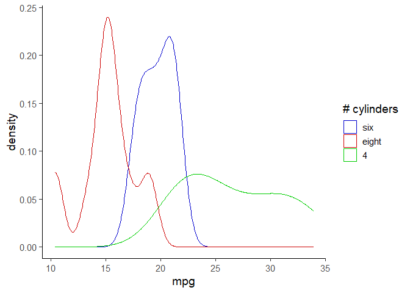
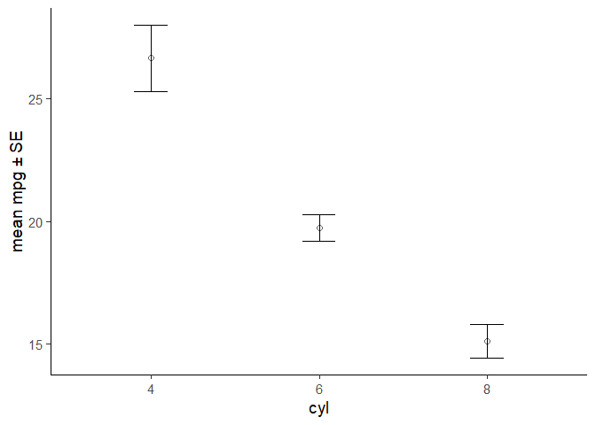
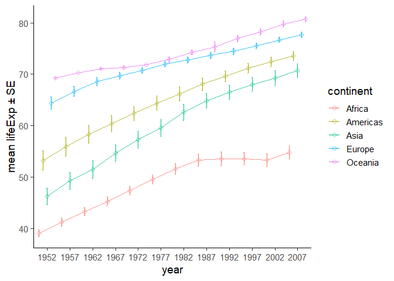

<!-- README.md is generated from README.Rmd. Please edit that file -->

# elucidate

<!-- badges: start -->

<a id="devex-badge" rel="Exploration" href="https://github.com/BCDevExchange/assets/blob/master/README.md"></a>
<!-- badges: end -->

## Project Status

This package is currently maintained by [Craig
Hutton](https://craig.rbind.io/), a Data Science Fellow working with the
Data Science and Analytics Branch of the [British Columbia Ministry of
Citizens’
Services](https://www2.gov.bc.ca/gov/content/governments/organizational-structure/ministries-organizations/ministries/citizens-services)
and the Research Branch of the [British Columbia Ministry of Social
Development & Poverty
Reduction](https://www2.gov.bc.ca/gov/content/governments/organizational-structure/ministries-organizations/ministries/social-development-poverty-reduction).

## Why `elucidate`?

`Elucidate` provides a collection of convenience functions to make data
analysis in R easier and more accessible for researchers:

  - Functions that help summarize data of multiple types (numeric,
    character strings, logicals, etc.) using descriptive statistics
    (`describe*`) split by any number of grouping variables with
    comparable performance to existing alternatives and enhanced
    customization via arguments.

  - Functions that make it easier to access the power of the
    [boot](https://cran.r-project.org/web/packages/boot/index.html)
    package to obtain confidence intervals for a variety of summary
    statistics (`*_ci`), with options for within-group calculations and
    parallelized computation to maximize performance.

  - Functions that help you visualize your data using the popular
    [ggplot2](https://ggplot2.tidyverse.org/) &
    [plotly](https://plot.ly/r/) packages more easily via a relatively
    simple API with sensible and well documented arguments rather than
    layers (`plot_*`).

  - Miscellaneous functions that fill in a few of the (rare) gaps in
    `R`’s statistical computing & data science toolkit, e.g. functions
    which are easy for experienced users to write on the fly but are
    challenging for `R` novices or researchers without programming
    experience to implement: the standard error of the mean (`se`), an
    operator that returns the values that do not match a vector (`%ni%`,
    i.e. the opposite of `%in%`), the mode of a numeric variable
    (`mode_of_y`), etc.

Inspired by tidyverse naming conventions, the core functions of
`elucidate` are organized into sets that begin with a common root
(e.g. `describe*`, `plot_*`), since this enables the user to see them
all as suggestions as you are coding in R studio.

Drawing from similar inspiration, many elucidate functions are also
designed to accept a data object as the 1st argument and to return a
data or plotting object (e.g. ggplot2 or plotly) so they are compatible
with the pipe operator from the
[magrittr](https://magrittr.tidyverse.org/reference/pipe.html) package
for easy integration into data processing pipelines.

## Installation

You can install the development version of elucidate from this
repository with:

``` r
# use devtools to install from a git repository
# install.packages("devtools") #uncomment and run this 1st if you haven't installed devtools already
library(devtools)

install_github("bcgov/elucidate", dependencies = TRUE)
```

The authors of `elucidate` acknowledge and express their gratitude to
the authors of the [tidyverse packages](https://www.tidyverse.org/),
[data.table](https://github.com/Rdatatable/data.table), and the
functions of other dependency packages which were used to build
`elucidate`, since without their effort and ingenuity `elucidate` would
mostly have remained a collection of ideas instead of functions.

## Usage

Use `describe()` to describe a single variable in a data frame of vector
of values:

``` r
library(elucidate)

#using a vector as input
describe(data = rnorm(1:1000, 100, 5))
#> # A tibble: 1 x 14
#>   cases     n    na  p_na  mean    sd    se    p0   p25   p50   p75  p100
#>   <int> <int> <int> <dbl> <dbl> <dbl> <dbl> <dbl> <dbl> <dbl> <dbl> <dbl>
#> 1  1000  1000     0     0  100.  4.89 0.155  86.7  96.8  100.  104.  115.
#> # ... with 2 more variables: skew <dbl>, kurt <dbl>

#using a data frame and specifying a variable in that data frame

describe(data = pdata, y = y1) #no grouping variables, numeric input class 
#> # A tibble: 1 x 14
#>   cases     n    na  p_na  mean    sd    se    p0   p25   p50   p75  p100
#>   <int> <int> <int> <dbl> <dbl> <dbl> <dbl> <dbl> <dbl> <dbl> <dbl> <dbl>
#> 1 12000 12000     0     0  154.  42.7  0.39  69.2  121.  145.  181.  289.
#> # ... with 2 more variables: skew <dbl>, kurt <dbl>

describe(pdata, g) #factor input class 
#> # A tibble: 1 x 11
#>   cases     n    na  p_na n_unique ordered v1_n   v2_n   v3_n   v4_n  v5_n 
#>   <int> <int> <int> <dbl>    <int> <lgl>   <chr>  <chr>  <chr>  <chr> <chr>
#> 1 12000 12000     0     0        5 FALSE   a_2592 b_2460 d_2376 e_23~ c_22~

describe(pdata, even) #logical input class 
#> # A tibble: 1 x 8
#>   cases     n    na  p_na n_TRUE n_FALSE p_TRUE p_FALSE
#>   <int> <int> <int> <dbl>  <dbl>   <dbl>  <dbl>   <dbl>
#> 1 12000 12000     0     0   6000    6000    0.5     0.5

pdata %>% describe(high_low) #character input class, data piped in
#> # A tibble: 1 x 7
#>   cases     n    na  p_na n_unique v1_n      v2_n    
#>   <int> <int> <int> <dbl>    <int> <chr>     <chr>   
#> 1 12000 12000     0     0        2 high_6045 low_5955

describe(pdata, d) #date input class 
#> # A tibble: 1 x 7
#>   cases     n    na  p_na n_unique start      end       
#>   <int> <int> <int> <dbl>    <int> <date>     <date>    
#> 1 12000 12000     0     0       12 2008-01-01 2019-01-01

#obtain within-group summaries by adding grouping variables

describe(pdata, y1, high_low) #one grouping variable
#> # A tibble: 2 x 15
#>   high_low cases     n    na  p_na  mean    sd    se    p0   p25   p50
#>   <chr>    <int> <int> <int> <dbl> <dbl> <dbl> <dbl> <dbl> <dbl> <dbl>
#> 1 high      6045  6045     0     0  154.  42.9 0.552  70.7  121.  145.
#> 2 low       5955  5955     0     0  154.  42.5 0.551  69.2  121.  145.
#> # ... with 4 more variables: p75 <dbl>, p100 <dbl>, skew <dbl>, kurt <dbl>

describe(pdata, y1, high_low, g) #two grouping variables
#> # A tibble: 10 x 16
#>    high_low g     cases     n    na  p_na  mean    sd    se    p0   p25
#>    <chr>    <fct> <int> <int> <int> <dbl> <dbl> <dbl> <dbl> <dbl> <dbl>
#>  1 high     e      1185  1185     0     0  134.  18.4 0.535  75.1  123.
#>  2 high     c      1117  1117     0     0  177.  57.5 1.72   77.8  125.
#>  3 low      d      1194  1194     0     0  174.  43.6 1.26   69.2  138.
#>  4 high     a      1303  1303     0     0  134.  26.0 0.721  75.9  112.
#>  5 low      b      1202  1202     0     0  151.  37.6 1.08   81.7  118.
#>  6 low      e      1167  1167     0     0  135.  18.8 0.55   77.4  123.
#>  7 low      c      1103  1103     0     0  177.  56.5 1.7    77.0  128.
#>  8 low      a      1289  1289     0     0  134.  25.6 0.713  80.1  112.
#>  9 high     d      1182  1182     0     0  174.  44.2 1.29   70.7  138.
#> 10 high     b      1258  1258     0     0  152.  38.0 1.07   74.4  118.
#> # ... with 5 more variables: p50 <dbl>, p75 <dbl>, p100 <dbl>, skew <dbl>,
#> #   kurt <dbl>

description <- describe(pdata, y1, high_low, g, even) #three grouping variables
```

To describe all variables in a data frame, use `describe_all()`:

``` r

#if more than one class of variable is summarized you'll get a list
#if only one class is present in the data, or only one is requested, you'll get a dataframe

describe_all(pdata) #all summary types in a list, not split by any grouping variables
#> $date
#> # A tibble: 1 x 8
#>   variable cases     n    na  p_na n_unique start      end       
#>   <chr>    <int> <int> <int> <dbl>    <int> <date>     <date>    
#> 1 d        12000 12000     0     0       12 2008-01-01 2019-01-01
#> 
#> $factor
#> # A tibble: 1 x 12
#>   variable cases     n    na  p_na n_unique ordered v1_n  v2_n  v3_n  v4_n 
#>   <chr>    <int> <int> <int> <dbl>    <int> <lgl>   <chr> <chr> <chr> <chr>
#> 1 g        12000 12000     0     0        5 FALSE   a_25~ b_24~ d_23~ e_23~
#> # ... with 1 more variable: v5_n <chr>
#> 
#> $character
#> # A tibble: 1 x 8
#>   variable cases     n    na  p_na n_unique v1_n      v2_n    
#>   <chr>    <int> <int> <int> <dbl>    <int> <chr>     <chr>   
#> 1 high_low 12000 12000     0     0        2 high_6045 low_5955
#> 
#> $logical
#> # A tibble: 1 x 9
#>   variable cases     n    na  p_na n_TRUE n_FALSE p_TRUE p_FALSE
#>   <chr>    <int> <int> <int> <dbl>  <dbl>   <dbl>  <dbl>   <dbl>
#> 1 even     12000 12000     0     0   6000    6000    0.5     0.5
#> 
#> $numeric
#> # A tibble: 6 x 15
#>   variable cases     n    na  p_na  mean    sd    se    p0   p25   p50
#>   <chr>    <int> <int> <int> <dbl> <dbl> <dbl> <dbl> <dbl> <dbl> <dbl>
#> 1 id       12000 12000     0     0 500.  289.  2.64    1   251.   500.
#> 2 y1       12000 12000     0     0 154.   42.7 0.39   69.2 121.   145.
#> 3 y2       12000 12000     0     0 100.   10.1 0.092  60.0  93.4  100.
#> 4 x1       12000 12000     0     0  50.5  28.9 0.264   1    25     50 
#> 5 x2       12000 12000     0     0 151.   28.8 0.263 101   126    150 
#> 6 x3       12000 12000     0     0 250.   28.9 0.264 201   225    251 
#> # ... with 4 more variables: p75 <dbl>, p100 <dbl>, skew <dbl>, kurt <dbl>

#only want summaries of certain variable classes? No problem, use the class argument: 

#numeric summary only, split by a grouping variable
pdata %>% 
  describe_all(high_low, 
               output = "dt", #you can ask for a tibble or data.table as output options
               class = "n") 
#>     variable high_low cases    n na p_na    mean      sd    se      p0
#>  1:       id     high  6045 6045  0    0 494.339 288.067 3.705   1.000
#>  2:       id      low  5955 5955  0    0 506.754 289.205 3.748   1.000
#>  3:       x1     high  6045 6045  0    0  50.499  28.760 0.370   1.000
#>  4:       x1      low  5955 5955  0    0  50.490  29.117 0.377   1.000
#>  5:       x2     high  6045 6045  0    0 150.870  28.829 0.371 101.000
#>  6:       x2      low  5955 5955  0    0 150.429  28.812 0.373 101.000
#>  7:       x3     high  6045 6045  0    0 250.458  28.941 0.372 201.000
#>  8:       x3      low  5955 5955  0    0 250.537  28.791 0.373 201.000
#>  9:       y1     high  6045 6045  0    0 153.740  42.936 0.552  70.748
#> 10:       y1      low  5955 5955  0    0 153.669  42.511 0.551  69.224
#> 11:       y2     high  6045 6045  0    0 108.084   6.081 0.078 100.005
#> 12:       y2      low  5955 5955  0    0  91.980   6.179 0.080  59.963
#>         p25     p50     p75     p100   skew   kurt
#>  1: 245.000 489.000 743.000 1000.000  0.031 -1.203
#>  2: 256.000 513.000 759.000 1000.000 -0.032 -1.194
#>  3:  26.000  50.000  75.000  100.000  0.009 -1.199
#>  4:  25.000  51.000  76.000  100.000  0.006 -1.217
#>  5: 126.000 151.000 176.000  200.000  0.003 -1.213
#>  6: 125.000 150.000 175.000  200.000  0.000 -1.206
#>  7: 225.000 250.000 276.000  300.000  0.017 -1.214
#>  8: 225.000 251.000 275.000  300.000 -0.004 -1.214
#>  9: 120.520 144.509 182.297  289.235  0.721 -0.230
#> 10: 121.375 145.085 179.503  288.781  0.758 -0.128
#> 11: 103.233 106.867 111.612  142.181  0.996  0.862
#> 12:  88.417  93.268  96.877   99.990 -1.055  1.125

#numeric and logical summaries only, split by a grouping variable
pdata %>%
 describe_all(high_low, output = "dt", class = c("n", "l"))
#> $logical
#>    variable high_low cases    n na p_na n_TRUE n_FALSE p_TRUE p_FALSE
#> 1:     even     high  6045 6045  0    0   3014    3031  0.499   0.501
#> 2:     even      low  5955 5955  0    0   2986    2969  0.501   0.499
#> 
#> $numeric
#>     variable high_low cases    n na p_na    mean      sd    se      p0
#>  1:       id     high  6045 6045  0    0 494.339 288.067 3.705   1.000
#>  2:       id      low  5955 5955  0    0 506.754 289.205 3.748   1.000
#>  3:       x1     high  6045 6045  0    0  50.499  28.760 0.370   1.000
#>  4:       x1      low  5955 5955  0    0  50.490  29.117 0.377   1.000
#>  5:       x2     high  6045 6045  0    0 150.870  28.829 0.371 101.000
#>  6:       x2      low  5955 5955  0    0 150.429  28.812 0.373 101.000
#>  7:       x3     high  6045 6045  0    0 250.458  28.941 0.372 201.000
#>  8:       x3      low  5955 5955  0    0 250.537  28.791 0.373 201.000
#>  9:       y1     high  6045 6045  0    0 153.740  42.936 0.552  70.748
#> 10:       y1      low  5955 5955  0    0 153.669  42.511 0.551  69.224
#> 11:       y2     high  6045 6045  0    0 108.084   6.081 0.078 100.005
#> 12:       y2      low  5955 5955  0    0  91.980   6.179 0.080  59.963
#>         p25     p50     p75     p100   skew   kurt
#>  1: 245.000 489.000 743.000 1000.000  0.031 -1.203
#>  2: 256.000 513.000 759.000 1000.000 -0.032 -1.194
#>  3:  26.000  50.000  75.000  100.000  0.009 -1.199
#>  4:  25.000  51.000  76.000  100.000  0.006 -1.217
#>  5: 126.000 151.000 176.000  200.000  0.003 -1.213
#>  6: 125.000 150.000 175.000  200.000  0.000 -1.206
#>  7: 225.000 250.000 276.000  300.000  0.017 -1.214
#>  8: 225.000 251.000 275.000  300.000 -0.004 -1.214
#>  9: 120.520 144.509 182.297  289.235  0.721 -0.230
#> 10: 121.375 145.085 179.503  288.781  0.758 -0.128
#> 11: 103.233 106.867 111.612  142.181  0.996  0.862
#> 12:  88.417  93.268  96.877   99.990 -1.055  1.125
```

If you want the counts for unique values of a variable, regardless of
class, use `counts()` or `counts_all()`:

``` r

counts(pdata$high_low) #output stucture is value_count, sorted in descending order by default
#> [1] "high_6045" "low_5955"

#use the order argument to sort in ascending order instead
counts(pdata$high_low, order = "a") 
#> [1] "low_5955"  "high_6045"

counts_all(pdata[, c("high_low", "even", "g")])
#> $high_low
#> [1] "high_6045" "low_5955" 
#> 
#> $even
#> [1] "FALSE_6000" "TRUE_6000" 
#> 
#> $g
#> [1] "a_2592" "b_2460" "d_2376" "e_2352" "c_2220"
```

Calculate confidence intervals for a sample mean, median or other
summary statistic using `describe_ci()` & `describe_ci_all()`:

``` r

#confidence intervals for the mean are calculated (by default) using a theoretical normal distribution...
pdata[1:100, ] %>% describe_ci(y1, stat = mean)
#> # A tibble: 1 x 3
#>   lower  mean upper
#>   <dbl> <dbl> <dbl>
#> 1  96.7  98.4  100.

pdata[1:100, ] %>% describe_ci(y1, g, stat = mean) #obtain CIs and means split by a grouping variable
#> # A tibble: 5 x 4
#>   g     lower  mean upper
#>   <fct> <dbl> <dbl> <dbl>
#> 1 a      94.2  97.1 100. 
#> 2 b      97.0 101.  104. 
#> 3 c      93.4  99.6 106. 
#> 4 d      93.2  96.2  99.2
#> 5 e      94.8  99.2 104.

#confidence intervals for other statistics are obtained using bootstrapping
pdata[1:100, ] %>% 
  describe_ci(y1, stat = median) #bootstrapped median
#> # A tibble: 1 x 3
#>   lower median upper
#>   <dbl>  <dbl> <dbl>
#> 1  96.5   97.8  101.

pdata[1:100, ] %>% 
  describe_ci(y1, stat = sd) #bootstrapped standard deviation
#> # A tibble: 1 x 3
#>   lower    sd upper
#>   <dbl> <dbl> <dbl>
#> 1  8.00  9.24  10.3

#describe_ci_all will return CIs for all numeric variables in a data frame

describe_ci_all(pdata[1:1000, ], stat = median) #bootstrapped CIs for the median
#> # A tibble: 6 x 4
#>   variable lower median upper
#>   <chr>    <dbl>  <dbl> <dbl>
#> 1 id       470.    500.  530.
#> 2 y1        99.8   101.  101.
#> 3 y2        99.6   101.  101.
#> 4 x1        47      51    53 
#> 5 x2       145     148   151 
#> 6 x3       249     253   256

describe_ci_all(pdata, stat = mean) #the default
#> # A tibble: 6 x 4
#>   variable lower  mean upper
#>   <chr>    <dbl> <dbl> <dbl>
#> 1 id       495.  500.  506. 
#> 2 y1       153.  154.  154. 
#> 3 y2        99.9 100.  100. 
#> 4 x1        50.0  50.5  51.0
#> 5 x2       150.  151.  151. 
#> 6 x3       250.  250.  251.

describe_ci_all(pdata, high_low, stat = mean) #split by a grouping variable
#> # A tibble: 12 x 5
#>    variable high_low lower  mean upper
#>    <chr>    <chr>    <dbl> <dbl> <dbl>
#>  1 id       high     487.  494.  502. 
#>  2 id       low      499.  507.  514. 
#>  3 x1       high      49.8  50.5  51.2
#>  4 x1       low       49.8  50.5  51.2
#>  5 x2       high     150.  151.  152. 
#>  6 x2       low      150.  150.  151. 
#>  7 x3       high     250.  250.  251. 
#>  8 x3       low      250.  251.  251. 
#>  9 y1       high     153.  154.  155. 
#> 10 y1       low      153.  154.  155. 
#> 11 y2       high     108.  108.  108. 
#> 12 y2       low       91.8  92.0  92.1
```

Use the `plot_*` set of functions to easily obtain ggplot2 or plotly
visualizations:

``` r
data(mtcars)

#basic density plot
plot_density(mtcars, x = mpg)
```



``` r

#histogram
plot_histogram(mtcars, x = mpg, fill_var = cyl) #mapping of variables to aesthetics is accomplished using *_var arguments
```


``` r

#customized density plot
mtcars %>% plot_density(x = mpg,
                        colour_var = cyl, #assign a variable to colour
                        colour_var_order = c("6", "8", "4"), #reorder the levels of the colour variable
                        colour_var_labs = c("six" = "6", "eight" = "8"), #recode the colour variable labels
                        colour_var_values = c("blue3", "red3", "green3"), #change the colours from the ggplot2 defaults
                        colour_var_title = "# cylinders")
```


``` r


#boxplot showing additional customization
plot_box(data = mtcars, #data source
         x = cyl, #variable on the x-axis
         y = hp, #variable to go on the y-axis
         xlab = "# of cylinders", #custom x-axis label
         ylab = "horsepower", #custom y-axis label
         fill_var = am, #assign variable am to fill
         fill_var_order = c("0", "1"), 
         fill_var_title = "transmission", #relabel the fill variable title in the legend
         fill_var_labs = c("manual" = "0", "automatic" = "1"), #recode the fill variable labels
         fill_var_values = c("blue", "red"), #change the colours from the ggplot2 defaults
         theme = "bw") #specify the theme
```


``` r

#violin plot with quantiles added
mtcars %>% plot_violin(y = mpg, x = cyl, fill = "blue", draw_quantiles = c(0.25, 0.5, 0.75))
```


``` r

#scatterplot with a regression lines
mtcars %>% plot_scatter(y = mpg, x = hp, colour_var = cyl, 
                        regression_line = T, 
                        regression_method = "lm") #default is to fit lines using a generalized additive model
```



``` r

#polynomial regression line can be added by specifying a model formula
mtcars %>%
  plot_scatter(y = mpg, x = hp,
               regression_line = T, regression_method = "lm", regression_se = T,
               regression_formula = y ~ poly(x, 2))
```


``` r


#plot a statistic with error bars
library(gapminder) #import the gapminder dataset from the gapminder package

gapminder %>%
   plot_stat_error(y = lifeExp, x = year, 
                   stat = "mean", error = "se", #mean +/- standard error, default error metric is a 95% CI
                   colour_var = continent, 
                   geom = "point", #either "bar" or "point"
                   p_size = 3, #adjust the size of the points
                   add_lines = T, #connect the points with lines. This is useful for repeated-measures data.
                   alpha = 0.6) #adjusts the transparency
```



The `%ni%` operator (“ni” for “not in”) can help you subset your data
like the `%in%` operator but returns an indicator for non-matches
instead of matches. This is particularly useful if you want to specify
exclusion criteria instead of inclusion criteria.

``` r
#subset data to extract rows with matching values using "%in%"
subset(pdata, g %in% c("a", "e"))

#subset data to extract rows with non-matching values using "%ni%"
subset(pdata, g %ni% c("a", "e"))

#equivalent to subset function for tidyverse users
dplyr::filter(pdata, g %ni% c("a", "e"))

#output omitted for space considerations
```

## Development Notes

`Elucidate` is still in the formative stage of development and
considerable changes may occur to it over the next several months
leading up to public release.

## Getting Help or Reporting an Issue

To report bugs/issues/feature requests, please contact the package
maintainer by [e-mail](mailto:Craig.Hutton@gov.bc.ca?subject=elucidate).
After `elucidate` has been released publicly, a more formal method of
reporting issues and requests will be implemented.

## License

Copyright 2019 Province of British Columbia

Licensed under the Apache License, Version 2.0 (the “License”); you may
not use this file except in compliance with the License. You may obtain
a copy of the License at

<http://www.apache.org/licenses/LICENSE-2.0>

Unless required by applicable law or agreed to in writing, software
distributed under the License is distributed on an “AS IS” BASIS,
WITHOUT WARRANTIES OR CONDITIONS OF ANY KIND, either express or implied.
See the License for the specific language governing permissions and
limitations under the License.
